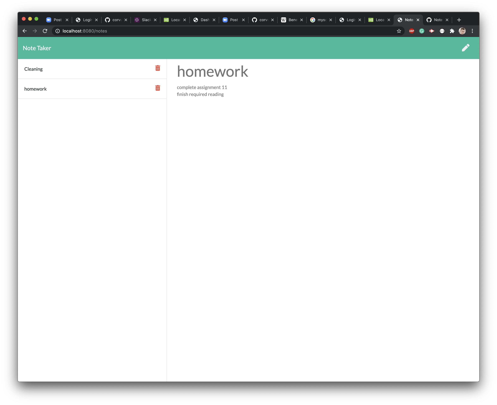

# Note_Taker_Assign11

# Description:
This assignment takes express, path, fs, and javascript, and taught me how to build a proper server.js that would refence the different boiler plates provided in order to create a functional note-taking application. 
The user will input their desired info within the form, and upon clicking save it will be pushed to a db.json, and then after refreshing the page they will find their note in the left table. Upon clicking said note it will bring the note forward in it's entirety. Upon clicking the delete button attached to that note it will be deleted from db.json and it will be cleared from the website upon it refreshing.
I built this project in order to test my knowledge in express.  

# Table of Contents
1. [Process](#Process)
2. [Issues](#Issues)
3. [Mastered](#Mastered)
4. [Improvements ](#Improvements)
4. [Link](#Link)
4. [Screenshot](#Screenshot)

# Process: 
* First I used the basic boiler plate discussed in class for establishing server.js
* After making sure that the htmls and css were routing to the port, I then created route.get to read the db.json that would contain the user's input and bring it to the front end. 
* I then used route.post to take the user's input should the user click the save button, write it into the db.json, and then post it to the website in the form of a saved note when the page was reloaded. This step was made easier with the help of fellow student Dilan Lee, who used her code to show me how async functions were not necesscary when using app.post, and that there was a simpler way to accomplish this. If my route.post looks similar to hers it is because of her help.  
* From there I created an if/else statement that would take the user's input and give it a unique ID, this was placed within post so that it would be placed inside the input when the user saved it.
* I then used the unique id in route.delete so that when the user clicked on the delete button for a certain note, it would filter through the db.json, find the id that matched with it, and then rewrite the db.json without it. Those changes would then be posted to the website when it was reloaded.
* Finally, with the help of my tutor, I found out that my server.js was disorganized, with all of the previously mentioned content placed within. To fix this, I created an apiroutes files and and htmlroutes file, took the api routing and html routing, and placed them within their respective files. From there I used path to require the necesscary folders to run when the port was called. This left server.js clean and organized. 

# Issues:
* When attempting to use GET '*' to return the index.html, it wouldn't return the notes.html file even though it had been established in GET '/notes'. It was later explained to me that '*' is a wildcard, so it matches and stops the other GET routes from being run. If you place it first, the others do not work because it matches everything. If it’s last, it’ll only run if no other route matches.
* From the beginning of this exercise I was getting this error "Uncaught SyntaxError: Unexpected token '<'". After searching through the files I discovered this was occuring in the link between the html and the javascript. This was occuring because I hadn't built an app.GET for the index.js, I built one for both the js and css to help connect everything on the localhost.
* Just because something works initially doesn't mean it will work in the long run. When coordinating with a learning assistant to build app.post, they thought it would be a good idea to build a series of async functions (with readFile) to develop more dry code. However, the readFile in app.get, app.post, and app.delete needed to do different things, and this caused the code to become needlessly complex. In order to fix this I had to coordinate with fellow student Dilan Li to return my code into something that would actually show the user's input. 

# Mastered:
* How to use express, router, and path
* How to create unique ID's so that we can delete the correct inqut
* How to use read and write file for a db.json so that we can maintain a library of the user's input
* How to set up a website on a server
* How to push to Heroku

# Improvements:
The html, css and javascript were provided as a boiler plate. One of the short comings of this boiler plate was that in order for the user to see their saved or deleted content, they could manually have to reload the page. If I was to improve upon this website I would change the index.js so that it would accept location.reload() so that it would automatically refresh the page upon the user pressing either save or delete. 

# Link:

# Screenshot: 
